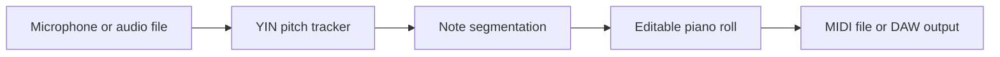

# Humline

**Sing or hum a melody, turn it into MIDI, and shape the result in a piano roll.**

[](https://github.com/MKlolbullen/humelody/actions/workflows/ci.yml)
[](https://github.com/juce-framework/JUCE/tree/72782788ce18c2d4d760b28e0921d6ffc6431102)
[](native/LICENSE-AGPL-3.0.txt)

| Try it | Download |
| --- | --- |
| [Open the private web studio](https://humline.victor-ahgren.chatgpt.site) | [Linux x86-64 · VST3 + standalone](https://humline.victor-ahgren.chatgpt.site/downloads/Humline-Linux-x86_64.zip) |
| Runs pitch detection and audio locally in the browser | [Native source + pinned JUCE tree](https://humline.victor-ahgren.chatgpt.site/downloads/Humline-native-source.zip) |

This is a separate project from AetherWave. Version 0.1 is a monophonic prototype:
one melodic source at a time, with a web studio and a native JUCE plug-in.



## What works

- Live microphone capture and offline audio-file transcription in the web app.
- Pitch, onset, release, and repeated-note detection for one melody at a time.
- Loudness-to-velocity mapping, piano-roll editing, undo/redo, and synth preview.
- Standard MIDI import/export with tempo maps and bounded malformed-file handling.
- Native VST3 and standalone builds with MIDI output, session restore, and a
  browser-free JUCE editor.
- Automated detector tests at 44.1, 48, and 96 kHz plus native processor tests
  for balanced MIDI, muted microphone output, suspend/resume, and state restore.

## Web studio

1. Open the app in an HTTPS browser. Set the tempo, press **Record voice**, and
   allow microphone access. Sing or hum a clear melody without accompaniment.
2. Press **Stop recording**. Drag notes to change pitch or timing; drag their
   right edges to change length. The inspector also accepts exact values.
3. Press **Play** to audition the notes through Soft keys, Pure tone, or Analog
   lead. This plays MIDI notes, not the original recording.
4. **Export MIDI** saves a standard `.mid` file for your DAW. **Import** accepts
   MIDI and audio files supported by the browser, including WAV.

Use **Try an example** to explore without microphone access. Arrow keys move a
selected note, Delete removes it, and Ctrl/Cmd+Z undoes an edit. Grid snap affects
manual edits; recorded timing stays unquantized.

The microphone is used only while recording. Raw audio is processed locally and
is not uploaded or retained. Takes currently live in memory: export MIDI before
closing or refreshing the page. Recording starts a new take; Undo retrieves the
previous take. Audio import is limited to 40 MB and 10 minutes; MIDI import to
8 MB and 10,000 notes.

## Detection controls

| Control | What it changes |
| --- | --- |
| Input gain | Level entering the detector; also affects velocity |
| Noise gate | Minimum level for a note to begin; raise it to reject room noise |
| Note stability | How long a new pitch must persist; higher values reduce chatter |
| Release time | How long silence or unclear pitch lasts before ending a note |
| Vocal range | Search range for low, mid, or high melodies (web) |
| Separate repeated notes | Retrigger after a new attack at the same pitch (web) |

Pitch becomes MIDI note number. Smoothed RMS loudness becomes initial velocity.
A note ends after silence, a stable pitch change, or a detected new attack.
Vibrato is allowed inside a hysteresis band. Sustained loudness changes are not
yet exported as expression, and slides become discrete notes, not pitch bend.
The detector is designed for voiced sounds, not chords, drums, or mixed songs.

There is analysis latency: the default window is about 85 ms, followed by note
stability and audio-device buffering. Recorded onsets include this delay. Use
the piano roll to adjust timing; automatic latency compensation is not included.
Breathiness, room noise, low notes, and strong harmonics can cause missed or
octave-shifted notes.

## Native DAW version

The native application has a piano roll, MIDI import/export, clip playback,
detector controls, undo, and DAW session state. It uses a native editor rather
than a browser view. See [native/README.md](native/README.md) for installation,
DAW routing, formats, limitations, and build commands.

### Linux install

```sh
unzip Humline-Linux-x86_64.zip
mkdir -p ~/.vst3
cp -a Humline-Linux-x86_64/Humline.vst3 ~/.vst3/
```

Rescan plug-ins in the DAW, then insert Humline as an audio effect on a microphone
track. If the host cannot route MIDI out of audio effects, use **Export MIDI** and
import the resulting file on an instrument track.

## Project layout

- `app/page.tsx`, `app/globals.css`: React studio and piano roll.
- `public/audio/tracker.js`: dependency-free YIN pitch detector and note segmenter.
- `public/audio/worklet.js`: microphone AudioWorklet, with silent audio output.
- `lib/audio.ts`: capture lifecycle, offline transcription, synth playback.
- `lib/midi.ts`: bounded MIDI parsing, tempo maps, and file generation.
- `native/Tracker.h`: allocation-free C++ detector equivalent.
- `native/Plugin.cpp`: JUCE processor, MIDI output, editor, session state.
- `tests/`: browser-engine, MIDI, native detector, and processor checks.

Web MIDI import preserves notes, channels, velocity, tempo changes, controller,
program, pitch-bend messages, and time/key signatures when exporting. The visual
ruler is currently a fixed 4/4 editing grid. Text metadata, SysEx, track names,
and track organization are not preserved. SMPTE timing and format 2 are rejected.
Playback auditions notes only, without interpreting controllers.

The web and C++ detectors share the algorithm, defaults, and test fixtures; they
are separate implementations, not one compiled DSP library. Synthetic detector
tests cover 44.1, 48, and 96 kHz. Real voice and DAW/device combinations still need
hands-on testing; no accuracy benchmark is claimed.

## Web development

Requires Node 22.13+ and pnpm 11.25.0. The lockfile is authoritative.

```sh
pnpm install --frozen-lockfile
pnpm dev
pnpm build
node --experimental-strip-types --test tests/tracker.test.mjs tests/midi.test.mjs
pnpm exec tsc --noEmit
```

The app uses React with Vinext and a Cloudflare-compatible server build. Audio
processing needs no API key, database, or remote service. Hosting access is
controlled by the deployment platform. In ChatGPT-managed development, use the
Sites build/preview workflow supplied by that environment.

## Native development

```sh
cmake -S native -B build/native -DCMAKE_BUILD_TYPE=Release
cmake --build build/native --parallel 2
ctest --test-dir build/native --output-on-failure
```

CMake downloads JUCE 9.0.2 from the official repository and verifies its pinned
SHA-256 digest before extraction. See [native/README.md](native/README.md) for the
Linux packages and platform-specific format notes.

## Status

This is an early but working implementation. Synthetic DSP and native processor
tests pass; real singers, microphones, rooms, DAWs, and audio drivers are still
the honest test. Current limitations include monophonic input, no pitch-bend or
continuous expression output, no host transport sync, and no automatic latency
compensation. Bug reports should include sample rate, buffer size, DAW, operating
system, vocal range, and a short reproducible input if it can be shared safely.
